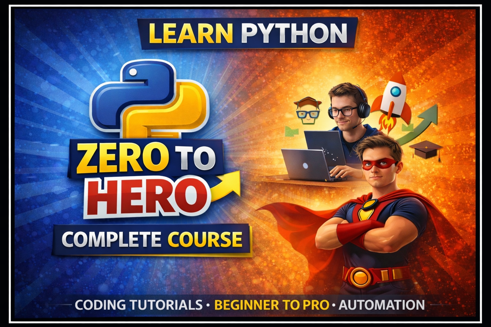

# Complete Python Zero to Hero Course

Complete Python for DevOps | Zero to Hero Course with Practical Sessions. Keep Learning!

**Youtube Playlist: [ Complete Python Course | Zero to Hero](https://youtu.be/9a7YlID5_yI?si=PAiTlSwU4OfcCaKK)**

## Course Requirements:
1. **Laptop (with admin privileges)**
2. **Desire to Learn.**

## Tools & Technologies
- Python 3.x [Download Python](https://www.python.org/downloads/)
- Linux VM using Vagrant - [Youtube Video](https://youtu.be/mT_HYuxF_qw?si=TA2PorKsuq7UOCto)
- VS Code - [Download VS Code](https://code.visualstudio.com/download)
- Docker - [Download Docker Desktop](https://www.docker.com/products/docker-desktop/)

## **Module 1: Python Fundamentals for DevOps**
- Why Python for DevOps (automation, system tasks, cloud)
- Installing Python, pip, virtual environments
- IDE setup (VS Code / PyCharm)
- Project: Hello World Program
- Youtube Video: [Module 1: Python Fundamentals for DevOps](https://youtu.be/DM0b7vpuQ78?si=G656FvGRQ2ziqtZ-)
---

## **Module 2: Control Flow, Functions & Core Logic**
- Basic syntax, variables, and data types
- Conditional statements (if, else, elif)
- Loops (for, while)
- Functions and lambda expressions
- Writing reusable and modular code
- Project:  Create a Calculator
- Youtube Video: [Module 2: Control Flow, Functions & Core Logic](https://youtu.be/DY3Zk_tzReE?si=6zZndS5K_EZQEwRO)
---
## **Module 3: Python Data Structures**
- Lists, tuples, sets, and dictionaries
- Common operations and methods
- List comprehensions for efficiency
- Data handling for automation tasks
- Project: Build a log analyzer that parses data and generates summaries using Python data structures.
- Youtube Video: [Module 3: Python Data Structures](https://youtu.be/YTLzvloO1vA?si=l5llUW0bbSs3JUt4)
---

## **Module 4: File, OS & Error Handling**
- Reading/writing files (text, CSV, JSON)
- Directory and file management (os, shutil)
- Exception handling (try, except, finally)
- Logging and basic debugging
- Project: Develop a backup automation script with error handling and logging.
- Youtube Video: [Module 4: File, OS & Error Handling](https://youtu.be/XiI6uFrY6Yk?si=bE1zEqTZYkEsCj7y)
---

## **Module 5: Automation, Shell & APIs**
- Automation concepts for DevOps
- Running shell commands with Paramiko / subprocess
- Working with REST APIs using requests
- Parsing and handling JSON data
- Project: Create an automation script that pulls data from an API and triggers system tasks based on the response.
- Youtube Video: [Module 5: Automation, Shell & APIs](https://youtu.be/QLDPuKv9Jjc?si=DBdb0lODZRs56BBF)
---

## **Module 6: DevOps Automation with Python**
- SSH automation using paramiko
- Docker automation using Python
- Putting everything together in real workflows
- **Project**: Build an end-to-end DevOps automation tool that:
  - Connects to a remote server 
  - Manages Docker containers
- Youtube Video: **To be uploaded**.
---
